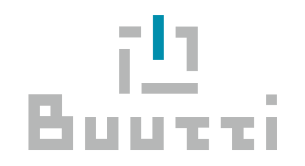

As the title says, I've just completed my first coding bootcamp. It lasted for four months between August and December 2020 and this had quite an impact on the choice of tools used to re-build this website.

_Buutti Oy was the company which held the bootcamp, and, displayed above, the company logo_

## How it began

It all started on July 29th 2020, one day after my birthday, when I noticed a Facebook Ad saying something like _"It's time to get the missing certification for your coding skills, and learn more about TypeScript"_. Not sure what filters they used to target their ads on Facebook (or what information Facebook might have about my coding skills) but I really felt like the text was kind of written for me. I applied, and some days later I've been called by someone from the company holding the bootcamp and held some sort of phone interview about my skills.

Later, in August, I was very happy to receive the answer that I've been accepted into the bootcamp (there were around 50 applicants, and 15 available places).

## The structure

The course was structured in two big parts, with some "career days" in between: the first part, which took 8 weeks, was the lecture period and the second part, was the project period.

### Career days

The course actually started with two of these career days, where we got to know each other, and discussed our strengths and weaknesses, and how we could improve the chances of landing a job in the industry.
That's also, when I realised that my profile is lacking some sort of certifications, and that I need to showcase some of the projects I've done during the years.

### Lecture period

The course was pretty fast paced, as all the participats presumably had at least a pretty good knowledge of JavaScript.
During the first lectures we quickly went through HTML, CSS and Vanilla JavaScript stuff, starting from the variables and conditionals, loops and functions, to things like callback functions, async/await and pretty much everything else related to JavaScript, and then TypeScript.
During the lectures, as well as between lecture days, we had a lot of assignments to do, and I think that was the best thing about the whole bootcamp experience; the fact that it was very practical. All the exercises and assignments were uploaded to some Gitlab repository, and the teacher would give feedback after reviewing our solutions.
We started with assignments like reading some number and then print out their sum, parsing data from arrays or JSON objects, and quickly advanced to building some small games like mars rovers on a map, with stuff like collisions, obstacles, etc., or working with data from some given API.

After that we started working with ExpressJS; we built some CLI application for a library, where the user was able sign up, to search, loan and return books, view and edit its information, etc.
In it's first version we stored and worked with data (books and users) in .json files, then we updated the solution to use MongoDB.

Last 3 weeks from the lecture period were focused on ReactJS, where we started with some simple (perhaps cliché) to-do apps, then building small games like bingo and "the memory game", with the final period being focused on building a front-end using React for the library project done previously as a CLI application.

During the lecture period we also had some days which were focused on the SCRUM methodology, workflows and best practices when using Git and Gitlab. This is how we organized ourselves during the project period.

### Project period

During the project period, we worked in groups of 5, focusing on building one project (chosen by us and agreed with the teacher, the main constraint being that it has to be written in TypesScript).
My team and I have chosen to build an e-commerce website in 4 months.

We used React for the frontend, ExpressJs for the backend and PostgreSQL for storing our data. This is also known as the **PERN stack**.
For the frontend we used some template I found in the <a target="_blank" rel="noreferrer" href="https://www.figma.com/community">Figma community</a>. With the help of TailwindCSS setting up the frontend for the project was a breeze.
I am especially proud of some custom hooks I've written on the frontend like `useCart` and `useAuth`, a nice, reusable, datatable component written from scratch for the admin section of the application, and on the backend the ORM written from scratch in TypeScript, inspired by Laravel's Eloquent ORM (although not as complex as Eloquent, the one I wrote was able to handle hasMany and belongsTo relationships, has a pretty decent query builder and eager loading.).

## Conclusion

For me, a guy which besides C++ and some VBA learned in High School and during the University studies, used to learn everything by myself and pick up new technologies mostly from courses, tutorials and screencasts online, this experience was really interesting.
I will tell you why, and why I think this bootcamp has been different than taking some online course.

The whole bootcamp was:

-   well-structured, we have completed a lot of small assignments, all of them being very diverse and handling different aspects;
-   focused on writing code (practical side) and not so much focused on listening to someone reading text from slides (theory);
-   very interactive, everyone was actively participating;
-   very intense, we covered a lot of topics in a relatively small amount of time;
-   especially productive, for me, as it was the only thing I was focusing full-time (for someone which is trying to keep up with the latest technologies mostly in the free time this is a huge thing).

I appreciate the opportunity, really enjoyed the whole bootcamp experience, and, I feel I've learned a lot during this period, especially about the Agile methodology and working in a team, which is probably the only thing you can never really learn before you actually participate in a group work.
