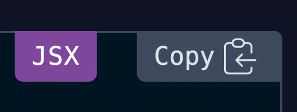

## Intro

During the past weekend I've been spending some time on setting up the code blocks visuals on this blog. After styling things a bit, I wanted to offer my readers a chance to grab the code with a _"Copy to Clipboard"_ button.

<Callout>

**Note!** This article describes how I implemented this functionality in my personal blog, which is made with [Gatsby](https://gatsbyjs.com) and [TailwindCSS](https://tailwindcss.com/) but same principles would apply with any [React](https://reactjs.org/) project with or without a CSS framework.

</Callout>

So, I've added the functionality for copying a string to the clipboard in a `copyToClipboard()` function, placed inside a new utils folder: `src/utils/copy-to-clipboard.js`. This function was written to return `true` when the copy operation completes successfully and `false` otherwise.

First I've added a new button inside the `Code` component, positioned absolute on the top-right corner, and linked the button to the function:

```jsx
import { copyToClipboard } from '../../utils/copy-to-clipboard';

<div className="absolute h-6 right-0 top-0 px-2 bg-gray-600 rounded-tr rounded-bl cursor-pointer text-gray-200 hover:text-white">
    <button className="flex items-center focus:outline-none" type="button" title="Copy to Clipboard" onClick={() => copyToClipboard(codeString))}>
        Copy
    </button>
</div>
```

## The Goal

The code above will copy the code to clipboard as it should, however, the user will get no feedback that the operation has been completed successfully (or not).

When the user clicks on the button, some sort of feedback needs to be triggered. Here's what I quickly came with:



Next, let's see how would we easily achieve that.

## The solution

First, we need a piece of state to toggle the animation on and off. I've added `confirmation` for this purpose. After that, we need to define our animation. I have used one of the default tailwind animations, but you could easily create one from scratch using CSS or even [define a new custom animation in TailwindCSS](https://tailwindcss.com/docs/animation#customizing).

Afterwards, based on the animation duration we will use one of [React's synthetic events](https://reactjs.org/docs/events.html) to update the piece of state defined earlier.

Because all the animations TailwindCSS comes with (out of the box) have duration `infinite` I will use `onAnimationIteration` synthetic event, however, if your animation does not loop infinitely, you could use `onAnimationEnd` instead.

Here's how these pieces are looking like when put together (I've stripped off the non-relevant parts of the code):

```jsx
import React, { useState } from 'react';
import { copyToClipboard } from '../../utils/copy-to-clipboard';

const Code = ({ codeString, language, ...props }) => {
    const [confirmation, setConfirmation] = useState(false);

    const copyCode = async () => {
        const copied = await copyToClipboard(codeString);
        if (copied) {
            setConfirmation(true);
        }
    };

    return (
        <div className="absolute h-6 right-0 top-0 px-2 bg-gray-600 rounded-tr rounded-bl cursor-pointer text-gray-200 hover:text-white">
            <button
                className="flex items-center focus:outline-none"
                type="button"
                title="Copy to Clipboard"
                onClick={copyCode}
                onAnimationIteration={() => setConfirmation(false)}
            >
                {confirmation ? (
                    <>
                        <span className="animate-ping" />
                        Copied
                    </>
                ) : (
                    'Copy'
                )}
            </button>
        </div>
    );
};
```

### How does it work?

In the code above, we're defining a piece of state called `confirmation`, which is `false` by default.

If `copyToClipboard()` function (which is running async) will resolve to `true`, `confirmation` will also be set to `true`, thus making the span element with the animation (_.animate-ping_) show.
After the animation loops once, `onAnimationIteration` will set the `confirmation` variable back to `false`. We don't even show the animation in this example.

Neat, huh!?

### How would you do it with Vue?

To achieve similar functionality in Vue, you might want to take a look at the transition `animationend` event.

As it turns out, prismjs, the syntax highlighter used on my website, doesn't support .vue out of the box, so I cannot display Vue code on my blog yet, but you could find this information in the official Vue documentation.

Based on the vue version you are using:

-   [Vue V2](https://vuejs.org/v2/guide/transitions.html#JavaScript-Hooks)
-   [Vue V3](https://v3.vuejs.org/guide/transitions-enterleave.html#javascript-hooks)
