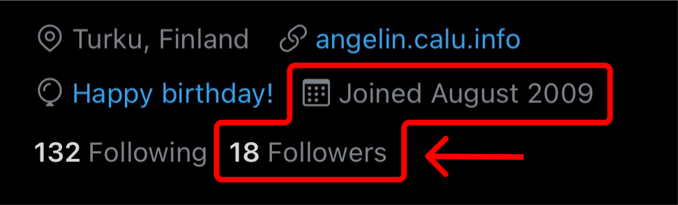

I had a really full year, which only made me want more (from myself) for the next one.

## New Career

The career shift is probably the most significant change I've made. After more than 10 years of dedicating myself to the shipbuilding industry, due to the effects of the Covid-19 pandemic, at the end of June 2020, my activity was suddenly put on hold for an unknown period.

This has not been affecting only the company I was doing design engineering work for, at that moment, but the whole industry so I knew that this was the perfect time to let my passion for software development take over.

My first step towards this direction was signing up for a coding Bootcamp which happened to pop up in one of the social networks at the right time.
I have written pretty much everything about [my coding Bootcamp experience](/blog/2020/i-ve-just-completed-my-first-coding-bootcamp/) in the very first post written on this blog.

The bootcamp was not only a great opportunity to practice my existing JavaScript skills, but also pick up new skills (like TypeScript) and, additionally, it helped me get a better understanding of what it means to work in a team (using modern methodologies).

But probably **the most important gain** is that the bootcamp gave me the **confidence boost I needed** as I was trying to get back to the industry from a different domain.

At the end of January, one of my former colleagues, sent me a message, with a link to the website of a software development company called Identio, where he suggested I should apply. I did that, got through two rounds of interviews, and I was offered a job 😊.

It was the first (and only) company I had an interview with from the software development industry.
On _March 15th 2021_, I had my first day working as a full-time software engineer at Identio.

## New Goals

My goals for the next year are to:

-   learn more about artificial intelligence and machine learning;
-   write more often on this blog;
-   improve my physical condition;
-   start working on some of the ideas I've been pushing over the past few years already;
-   be more active on social media channels. This is how [my Twitter account](https://twitter.com/AngelinCalu) looks like, today 28.07.2021: 🙃

So, I would like to, overall, be more active in all aspects of life. Being busy pays off.

## Post Scriptum

I have gotten an invitation to test out the new [Github Copilot](https://copilot.github.com/) and I have kept it on while I was writing this post. Have been using it for the past two weeks already but this is the first time I'm seeing this (post writing) side of it.

I'm planning to write a post about it at some point in the near future.
