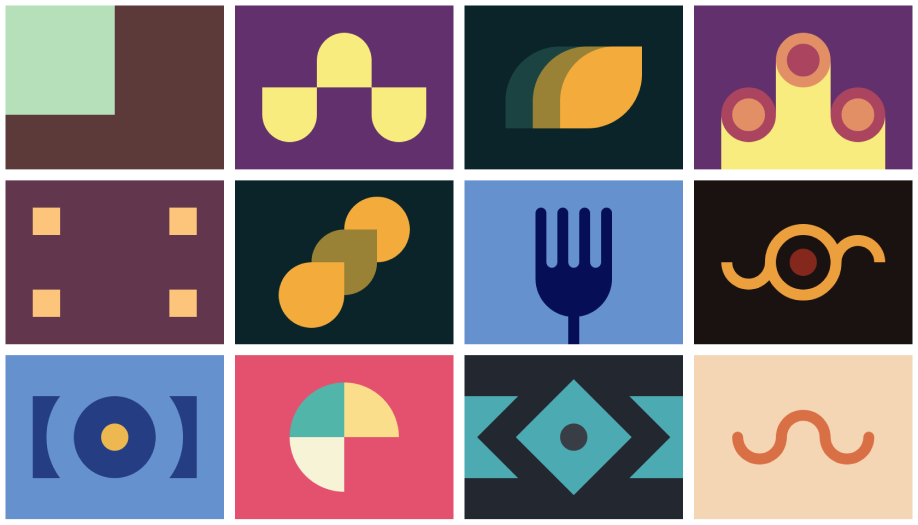

## Intro

This weekend I have started tackling the challenges on [CSSBattle.dev](https://cssbattle.dev), after watching some YouTube video. That happened on Saturday while my kids were taking an afternoon nap, I was thinking that I'm going to quickly try a couple of challenges, and then I'm done, however I can now say that the challenges are quite addictive.

So, Saturday, I've done 12 challenges (the whole [Battle #1](https://cssbattle.dev/battle/1)).

<Callout>
    I'm planning to keep this post updated with my progress on the website. Last update: <b>2021-01-25</b>
</Callout>

## The challenge

OK, I'm going to be short about this: all the challenges are to be solved with only HTML and CSS. For each challenge you get an image, and you need to replicate it perfectly using the shortest code possibly.
The fist 12 challenges were reasonably easy, as you could also see in the image below, however the tricky part is in the code length.

The first challenge (the one in the top-left corner) was done by more than 100 people with only 54 characters of code. I managed to do it with _~~80~~_ ✌️ **69** characters.
The difference is huge, and in other challenges even bigger.

This is definitely not something to do when working on a project, however stripping down code while keeping the same result is an interesting practice. This is called [Code-golf](https://en.wikipedia.org/wiki/Code_golf).

## My profile

If you want to se my profile on CSSBattle, you could find it [here](https://cssbattle.dev/player/angelin).

## CSSBattle Minifier

I've started building here a code minifier which I'm planning to use on the CSSBattle website, to save me from doing a lot of things manually.

For starters I'll begin with the [tips and tricks published on their website](https://cssbattle.dev/tips).

<Callout>

For an early launch, the options which are not yet implemented will be disabled.

If you would like to help me polish this minifier, please feel free to submit a Pull Request on Github (my website is open-source).

</Callout>

import Minifier from './minifier';

<Minifier />

My current global rank (as of today 25.01.2021) is 1140th out of 46732. Hopefully I will be able to find some time to compete and climb up the ladder.
